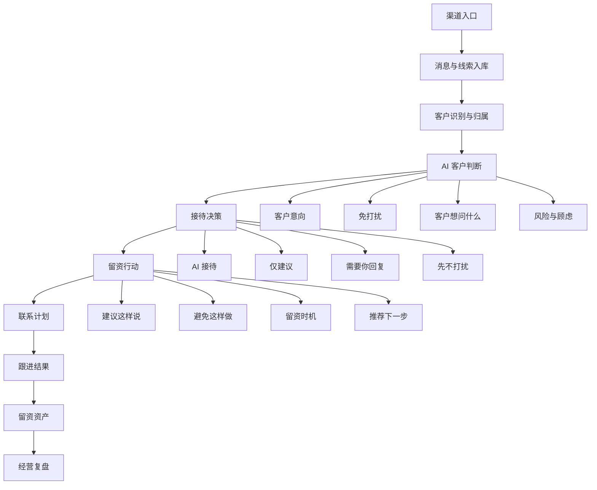
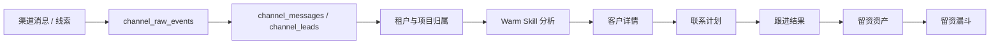

# Warm Agent CS 系统功能逻辑架构

> 目标：先把系统能力拆清楚，避免原型变成页面集合。

## 1. 系统一句话

Warm Agent CS 是销售每天使用的 AI 客服留资工作台。

它不是普通客服聊天后台，也不是 CRM。它的核心逻辑是：

```text
客户进来
  -> 系统看懂客户
  -> 判断客户能不能推进到留资
  -> 告诉销售怎么接、怎么说、什么不能做
  -> 生成联系计划
  -> 记录跟进结果
  -> 复盘哪个入口、客户、话术更有效
```

## 2. 最高层功能架构



## 3. 七个功能层

| 功能层 | 用户关心的问题 | 系统必须提供什么 | 第一阶段重要性 |
| --- | --- | --- | --- |
| 渠道入口层 | 客户从哪里来？ | 抖音、小红书、巨量、官网等来源识别 | P0 |
| 消息线索层 | 客户说了什么？是聊天还是线索？ | 原始事件、标准消息、标准线索 | P0 |
| 客户判断层 | 这个客户现在能不能要联系方式？ | 客户意向、免打扰、意图、顾虑、风险 | P0 |
| 接待决策层 | AI 回还是我回？ | AI 接待、仅建议、需要你回复、先不打扰 | P0 |
| 留资行动层 | 我怎么说？不能怎么说？ | 推荐话术、避免动作、留资建议 | P0 |
| 联系计划层 | 谁要后续跟？什么时候跟？ | 待联系客户、原因、最晚时间、负责人 | P0 |
| 留资资产层 | 留资之后沉淀在哪里？ | 联系方式、需求、来源、归属、跟进历史、状态 | P0 |
| 经营复盘层 | 跟完有没有效果？ | 留资、预约、流失、渠道转化 | P1 |

## 4. 第一阶段系统主链路



这个链路里，任何一个页面都必须能说清楚自己服务哪一步。

## 5. 系统必须能查什么

| 查询对象 | 要回答的问题 | 典型字段 |
| --- | --- | --- |
| 入口来源 | 客户从哪个平台进来？ | channel_type、communication_type、channel_account_id |
| 客户消息 | 客户最近说了什么？ | content、sender_type、created_at、conversation_id |
| 客户意向 | 客户现在愿不愿意继续聊？ | trust_level / 客户意向、purchase_probability / 留资可能性 |
| 免打扰 | 客户是不是不想被打扰？ | anti_disturbance、do_not_do、reply_mode |
| 客户意图 | 客户主要想问什么？ | intent、concerns、decision_stage |
| 接待模式 | AI 回，还是销售回？ | reply_mode、handover_needed、handover_reason |
| 留资动作 | 应该怎么引导？ | recommended_action、suggested_script、forbidden_actions |
| 联系计划 | 谁该跟，什么时候跟？ | priority、deadline、assigned_to、status |
| 跟进结果 | 跟完怎么样？ | result_type、lead_captured、appointment_at、loss_reason |
| 留资资产 | 留资后这个客户归谁、下一步怎么管理？ | phone、wechat、lead_owner、asset_status、next_followup_at |
| 漏斗复盘 | 哪个渠道有效？ | channel、valid_inquiry、lead_captured、appointment_set |

## 6. 不能混在一起的东西

第一阶段必须区分清楚：

1. 消息接待，不等于客户管理；
2. 客户详情，不等于 CRM 档案；
3. 留资资产，不等于完整 CRM；
4. 联系计划，不等于工单；
5. 留资漏斗，不等于复杂 BI；
6. AI 建议，不等于 Prompt 平台；
7. 渠道入口，不等于复杂渠道配置中心。

系统越清楚，页面越少但越像产品。
